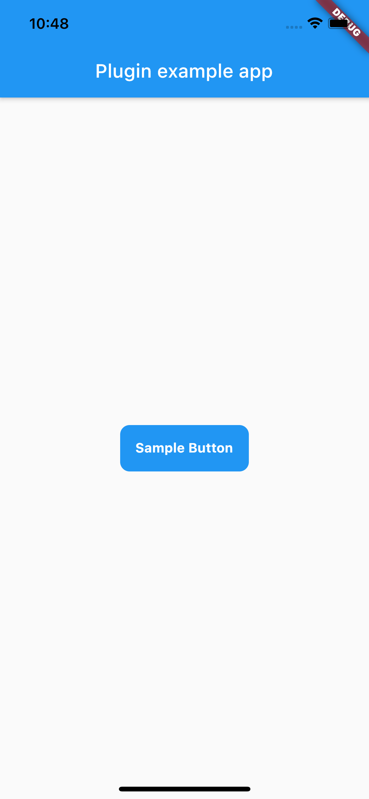
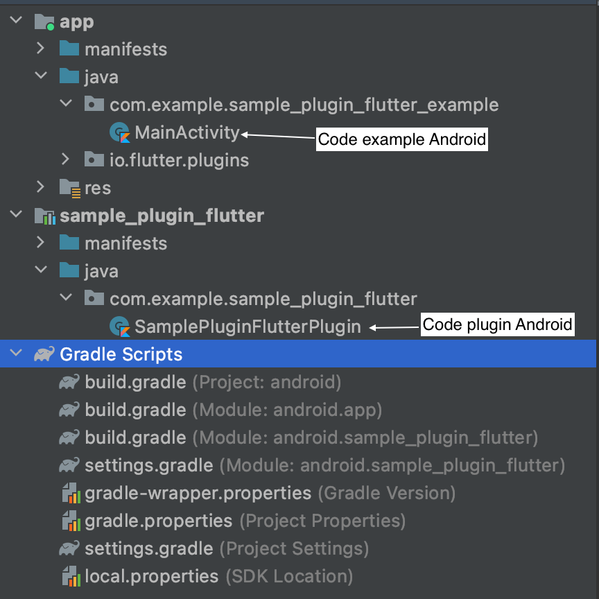
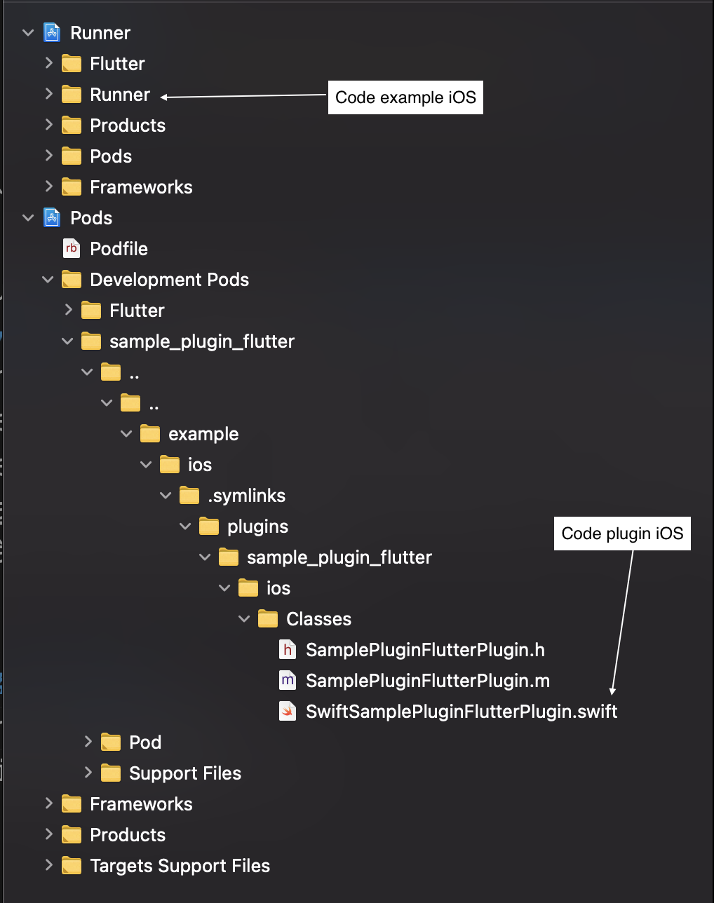
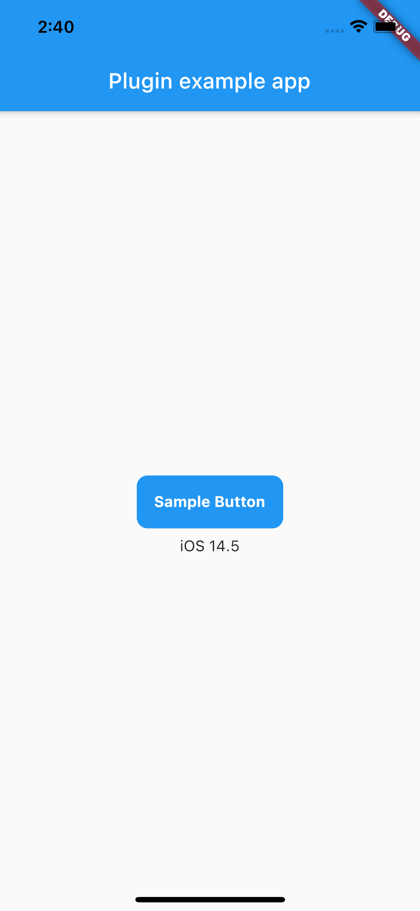
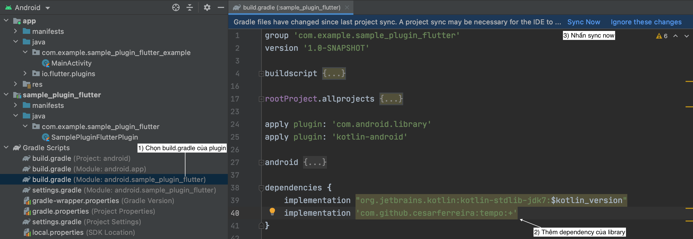
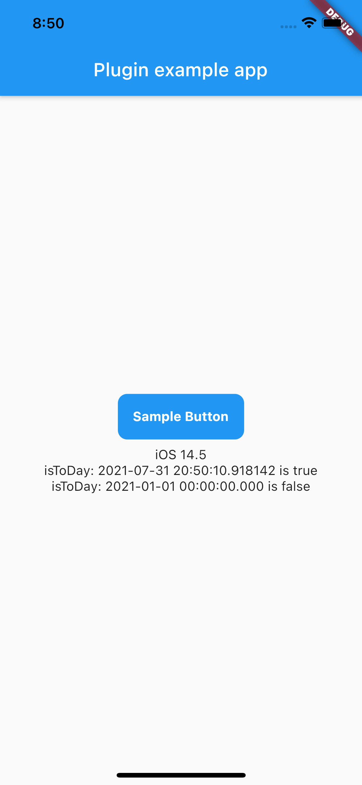

# [Flutter] Hướng dẫn tạo plugin và gọi thư viện native

## Giới thiệu
Hiện nay tài liệu cho việc tạo plugin cho flutter khá ít, mà tài liệu để plugin gọi xuống các thư viện native càng hiếm hơn nữa. Nên hôm nay mình viết bài này để giúp mọi người dễ dàng hơn trong việc viết plugin với flutter. Cùng bắt đầu thôi nào!

## Phần 1. Hướng dẫn tạo plugin

Để tạo 1 plugin bạn cần dùng lệnh **flutter create --template=plugin**
- Sử dụng tùy chọn **--platforms** để chỉ định plugin sẽ có những ngôn ngữ nào. Có các tùy chọn như: **android, ios, web, linux, macos, windows**
- Sử dụng tùy chọn **--org** để chỉ định tên miền cho tổ chức của bạn
- Sử dụng tùy chọn **--a** để chỉ định ngôn ngữ cho android. Bạn có thể chọn **java** hoặc **kotlin**
- Sử dụng tùy chọn **--i** để chỉ định ngôn ngữ cho ios. Bạn có thể chọn **swift** hoặc **objc**
- Và cuối cùng sẽ là tên plugin của bạn

Tham khảo:
```bash
flutter create --org com.example --template=plugin --platforms=android,ios -a kotlin -i swift sample_plugin_flutter
```

Sau khi thao tác trên bạn sẽ có 1 plugin trong thư mục sample_plugin_flutter với một số file cơ bản sau:
- **lib/sample_plugin_flutter.dart** 
=> API Dart cho plugin. File này dùng để kết nối các thành phần của plugin, kết nối với native code
- **android/src/main/kotlin/com/example/sample_plugin_flutter/SamplePluginFlutterPlugin.kt** 
=> Triển khai API plugin trong Kotlin dành riêng cho nền tảng Android.
- **ios/Classes/SwiftSamplePluginFlutterPlugin.swift** 
=> Triển khai API plugin trong Swift dành riêng cho nền tảng iOS.
- **example/** 
=> Một ứng dụng Flutter phụ thuộc vào plugin và minh họa cách sử dụng nó.
- **lib/src/** 
=> Thư mục này sẽ không có sẵn, nhưng bạn cần tạo thư mục này để chứa các file private. Bạn chỉ public các file cần thiết thông qua khai báo export trong **lib/sample_plugin_flutter.dart**


## Phần 2. Hướng dẫn tạo Widget với plugin

Để tạo Widget hay Function để người dùng plugin để thể gọi và sử dụng, bạn cần đưa file đó vào thư mục src và export nó ra ngoài. Khi làm vậy, người dùng chỉ cần import 1 dòng duy nhất là có thể sử dụng plugin của bạn.

Trong thư mục **lib/src** các bạn tạo 1 file dart mới và đặt tên là **sample_button.dart**

```dart
import 'package:flutter/material.dart';

class SampleButton extends StatelessWidget {
  final String text;
  final VoidCallback? onPressed;

  const SampleButton({
    Key? key,
    required this.text,
    this.onPressed,
  }) : super(key: key);

  @override
  Widget build(BuildContext context) {
    return TextButton(
      onPressed: onPressed,
      child: Container(
        padding: EdgeInsets.all(16),
        decoration: BoxDecoration(
          color: Colors.blue,
          borderRadius: BorderRadius.circular(10),
        ),
        child: Text(
          text,
          style: TextStyle(
            color: Colors.white,
            fontWeight: FontWeight.bold,
          ),
        ),
      ),
    );
  }
}
```

Trong thư mục **lib/src** các bạn tạo thêm file **src.dart**, file này sẽ chứa tất cả file mà bạn muốn export ra ngoài.

```dart
export 'sample_button.dart';
```

Trong file **lib/sample_plugin_flutter.dart** bạn nên xóa hết code mặc định đi. File này các bạn sẽ chứa những file bạn muốn export hoặc export những plugin khác có trong dependence của bạn.

```dart
export 'src/src.dart';
```

Giờ thì thử build Widget này lên từ app example nhé. Trong file **example/lib/main.dart** bạn đổi lại code như sau:

```dart
import 'package:flutter/material.dart';
import 'package:sample_plugin_flutter/sample_plugin_flutter.dart';

void main() {
  runApp(MyApp());
}

class MyApp extends StatefulWidget {
  @override
  _MyAppState createState() => _MyAppState();
}

class _MyAppState extends State<MyApp> {
  @override
  Widget build(BuildContext context) {
    return MaterialApp(
      home: Scaffold(
        appBar: AppBar(
          title: const Text('Plugin example app'),
        ),
        body: Center(
          child: Column(
            mainAxisSize: MainAxisSize.min,
            children: [
              /// Phần 2. Hướng dẫn tạo Widget với plugin
              SampleButton(
                text: "Sample Button",
                onPressed: () {
                  print("Sample Button Click");
                },
              ),
            ],
          ),
        ),
      ),
    );
  }
}
```

Chạy **flutter run** để xem kết quả thôi nào.



## Phần 3. Hướng dẫn gọi native code từ plugin

### 1. Làm việc với IDE native
Khi làm việc với native code, bạn nên dùng Android Studio khi code Android và Xcode khi code iOS nhé. 2 IDE này sẽ hỗ trợ bạn tốt hơn trong việc báo lỗi và cả debug code. 
 - Trong Android Studio bạn mở thư mục **example/android/**, giao diện cây thư mục trong IDE sẽ như thế này.
 
 
 - Trong Xcode bạn mở thư mục **example/ios/Runner.xcworkspace**, giao diện cây thư mục trong IDE sẽ như thế này.
 


### 2. Code native cho plugin
Để gọi native code, bạn sẽ cần sử dụng channel, thường channel nên được đặt cùng tên với tên plugin của bạn. Thông qua channel chúng ta sẽ gọi hàm native và nhận kết quả từ đó. 

Các bạn có thể tham khảo mapping các loại biến giữa các nền tảng [tại đây](https://flutter.dev/docs/development/platform-integration/platform-channels#codec).

Trong thư mục **lib/src** các bạn tạo 1 file dart mới và đặt tên là **sample_call_native.dart**. File này sẽ tạo **MethodChannel('sample_plugin_flutter')** để liên kết đến native code và hàm **platformVersion()** để kiểm tra version của thiết bị người dùng.

```dart
import 'dart:async';

import 'package:flutter/services.dart';

class SampleCallNativeFlutter {
  static const MethodChannel _channel =
      const MethodChannel('sample_plugin_flutter');

  static Future<String?> get platformVersion async {
    final String? version = await _channel.invokeMethod('getPlatformVersion');
    return version;
  }
}
```

Trong file **lib/src/src.dart** các bạn thêm dòng export.

```dart
export 'sample_call_native.dart';
```
Trong file **android/src/main/kotlin/com/example/sample_plugin_flutter/SamplePluginFlutterPlugin.kt** đã code demo sẵn channel và cách trả về platformVersion như minh họa phía dưới. Tại hàm onMethodCall, cần kiểm tra tên call.method được gọi là gì và trả về cho flutter kết quả thông qua result.success(). 

Lưu ý: nếu bạn gọi 1 function không cần trả kết quả, bạn vẫn phải gọi result.success(null) để báo về cho flutter biết hàm đã thực hiện xong.

```kotlin
package com.example.sample_plugin_flutter

import androidx.annotation.NonNull

import io.flutter.embedding.engine.plugins.FlutterPlugin
import io.flutter.plugin.common.MethodCall
import io.flutter.plugin.common.MethodChannel
import io.flutter.plugin.common.MethodChannel.MethodCallHandler
import io.flutter.plugin.common.MethodChannel.Result

/** SamplePluginFlutterPlugin */
class SamplePluginFlutterPlugin: FlutterPlugin, MethodCallHandler {
  /// The MethodChannel that will the communication between Flutter and native Android
  ///
  /// This local reference serves to register the plugin with the Flutter Engine and unregister it
  /// when the Flutter Engine is detached from the Activity
  private lateinit var channel : MethodChannel

  override fun onAttachedToEngine(@NonNull flutterPluginBinding: FlutterPlugin.FlutterPluginBinding) {
    channel = MethodChannel(flutterPluginBinding.binaryMessenger, "sample_plugin_flutter")
    channel.setMethodCallHandler(this)
  }

  override fun onMethodCall(@NonNull call: MethodCall, @NonNull result: Result) {
    when (call.method) {
      "getPlatformVersion" -> result.success("Android ${android.os.Build.VERSION.RELEASE}")
      else -> {
        result.notImplemented()
      }
    }
  }

  override fun onDetachedFromEngine(@NonNull binding: FlutterPlugin.FlutterPluginBinding) {
    channel.setMethodCallHandler(null)
  }
}

```

Tương tự trong file **ios/Classes/SwiftSamplePluginFlutterPlugin.swift** đã code demo sẵn channel và cách trả về platformVersion như minh họa phía dưới. Tại hàm handle, cần kiểm tra tên call.method được gọi là gì và trả về cho flutter kết quả thông qua result(). Nếu bạn gọi 1 function không cần trả kết quả, bạn vẫn cần gọi result(nil) để báo về cho flutter biết hàm đã thực hiện xong.

```swift
import Flutter
import UIKit

public class SwiftSamplePluginFlutterPlugin: NSObject, FlutterPlugin {
  public static func register(with registrar: FlutterPluginRegistrar) {
    let channel = FlutterMethodChannel(name: "sample_plugin_flutter", binaryMessenger: registrar.messenger())
    let instance = SwiftSamplePluginFlutterPlugin()
    registrar.addMethodCallDelegate(instance, channel: channel)
  }

  public func handle(_ call: FlutterMethodCall, result: @escaping FlutterResult) {
    switch call.method {
    case "getPlatformVersion":
        result("iOS " + UIDevice.current.systemVersion)
    default:
        result(nil)
    }
  }
}
```

Trong file **example/lib/main.dart** bạn đổi lại code như sau:

```dart
import 'package:flutter/material.dart';
import 'package:sample_plugin_flutter/sample_plugin_flutter.dart';

void main() {
  runApp(MyApp());
}

class MyApp extends StatefulWidget {
  @override
  _MyAppState createState() => _MyAppState();
}

class _MyAppState extends State<MyApp> {
  @override
  Widget build(BuildContext context) {
    return MaterialApp(
      home: Scaffold(
        appBar: AppBar(
          title: const Text('Plugin example app'),
        ),
        body: Center(
          child: Column(
            mainAxisSize: MainAxisSize.min,
            children: [
              /// Phần 2. Hướng dẫn tạo Widget với plugin
              SampleButton(
                text: "Sample Button",
                onPressed: () {
                  print("Sample Button Click");
                },
              ),

              /// Phần 3. Hướng dẫn gọi native code từ plugin
              FutureBuilder<String?>(
                future: SampleCallNativeFlutter.platformVersion,
                builder: (_, snapshoot) {
                  return Text(snapshoot.data ?? '');
                },
              ),
            ],
          ),
        ),
      ),
    );
  }
}
```

Chạy **flutter run** để xem kết quả thôi nào.



## Phần 4: Hướng dẫn thêm thư viện native

Trong phần này, mình sẽ demo việc gửi 1 DateTime từ flutter xuống native code để kiểm tra xem có phải ngày hiện tại hay không? 
Mình sẽ sử dụng thư viện [Tempo](https://github.com/cesarferreira/tempo) của tác giả cesarferreira cho Android và [SwiftDate](https://cocoapods.org/pods/SwiftDate) của tác giả Daniele Margutti cho iOS.

Vì flutter và native không giao tiếp với nhau bằng biến loại DateTime được, nên mình sẽ cần chuyển DateTime sang dạng string UTC để xử lý nhé.

### Thêm code flutter để hiển thị kết quả

Trong file **lib/src/sample_call_native.dart** các bạn thêm 1 hàm như sau:

```dart
  static Future<bool?> isToday(DateTime dateTime) async {
    final date = dateTime.toUtc().toIso8601String();
    final bool? isSuccess = await _channel.invokeMethod(
      'isToday',
      {
        'dateTime': date,
      },
    );
    return isSuccess;
  }
```
Trong file **example/lib/main.dart** bạn đổi lại code như sau:

```dart
import 'package:flutter/material.dart';
import 'package:sample_plugin_flutter/sample_plugin_flutter.dart';

void main() {
  runApp(MyApp());
}

class MyApp extends StatefulWidget {
  @override
  _MyAppState createState() => _MyAppState();
}

class _MyAppState extends State<MyApp> {
  @override
  Widget build(BuildContext context) {
    return MaterialApp(
      home: Scaffold(
        appBar: AppBar(
          title: const Text('Plugin example app'),
        ),
        body: Center(
          child: Column(
            mainAxisSize: MainAxisSize.min,
            children: [
              /// Phần 2. Hướng dẫn tạo Widget với plugin
              SampleButton(
                text: "Sample Button",
                onPressed: () {
                  print("Sample Button Click");
                },
              ),

              /// Phần 3. Hướng dẫn gọi native code từ plugin
              FutureBuilder<String?>(
                future: SampleCallNativeFlutter.platformVersion,
                builder: (_, snapshoot) {
                  return Text(snapshoot.data ?? '');
                },
              ),

              /// Phần 4. Hướng dẫn gọi native code từ plugin
              FutureBuilder<bool?>(
                future: SampleCallNativeFlutter.isToday(DateTime.now()),
                builder: (_, snapshoot) {
                  return Text('isToDay: ${DateTime.now()} is ${snapshoot.data}');
                },
              ),
              FutureBuilder<bool?>(
                future: SampleCallNativeFlutter.isToday(DateTime(2021,01,01)),
                builder: (_, snapshoot) {
                  return Text('isToDay: ${DateTime(2021,01,01)} is ${snapshoot.data}');
                },
              ),
            ],
          ),
        ),
      ),
    );
  }
}
```

### Thêm thư viện cho iOS

Thường khi thêm 1 thư viện vào code iOS, bạn cần sử dụng Cocoapods thêm nó vào Podfile. Nhưng với plugin thì bạn sẽ thêm dependency nó vào **ios/sample_plugin_flutter.podspec**. 

File này cũng giúp bạn khai báo *s.static_framework = true*(1 số thư viện native cần phải khai báo biến này) hay s.ios.deployment_target = '9.0' (để giới hạn version build iOS). 

(Nếu bạn chưa biết Cocoapods là gì, bạn có thể tham khảo [tại đây](https://guides.cocoapods.org/using/using-cocoapods.html))

```shell
#
# To learn more about a Podspec see http://guides.cocoapods.org/syntax/podspec.html.
# Run `pod lib lint sample_plugin_flutter.podspec` to validate before publishing.
#
Pod::Spec.new do |s|
  s.name             = 'sample_plugin_flutter'
  s.version          = '0.0.1'
  s.summary          = 'A new flutter plugin project.'
  s.description      = <<-DESC
A new flutter plugin project.
                       DESC
  s.homepage         = 'http://example.com'
  s.license          = { :file => '../LICENSE' }
  s.author           = { 'Your Company' => 'email@example.com' }
  s.source           = { :path => '.' }
  s.source_files = 'Classes/**/*'
  s.dependency 'Flutter'
  s.dependency 'SwiftDate' # Khai báo thư viện iOS tại đây
  s.platform = :ios, '8.0'

  # Flutter.framework does not contain a i386 slice.
  s.pod_target_xcconfig = { 'DEFINES_MODULE' => 'YES', 'EXCLUDED_ARCHS[sdk=iphonesimulator*]' => 'i386' }
  s.swift_version = '5.0'
end
```

Sau đó bạn cần chạy **pod install** cho thư mục **example/ios** và vào Xcode chọn menu **Product/Clean Build Folder**. 
Trong file **SwiftSamplePluginFlutterPlugin** bạn đổi lại code như sau:

```swift
import Flutter
import UIKit
import SwiftDate

public class SwiftSamplePluginFlutterPlugin: NSObject, FlutterPlugin {
  public static func register(with registrar: FlutterPluginRegistrar) {
    let channel = FlutterMethodChannel(name: "sample_plugin_flutter", binaryMessenger: registrar.messenger())
    let instance = SwiftSamplePluginFlutterPlugin()
    registrar.addMethodCallDelegate(instance, channel: channel)
  }

  public func handle(_ call: FlutterMethodCall, result: @escaping FlutterResult) {
    switch call.method {
    case "getPlatformVersion":
        result("iOS " + UIDevice.current.systemVersion)
    case "isToday":
        isToday(call, result)
    default:
        result(nil)
    }
  }
    
    private func isToday(_ call: FlutterMethodCall,_ result: @escaping FlutterResult) {
        let arguments = call.arguments as! Dictionary<String, Any>
        let dateTime = arguments["dateTime"] as! String;
        // Convert to local
        let localDate = dateTime.toDate(nil, region: Region.current)
        // Check isToday
        let checkToday = localDate?.isToday
        result(checkToday)
    }
}
```

Thế là xong bên iOS, giờ qua phần của Android.

### Thêm thư viện cho Android

Trong **Gradle Scripts/build.gradle(Module: android.sample_plugin_flutter)** bạn thêm dòng bên dưới ở cuối file và nhấn **Sync now**
```shell
dependencies {
  implementation 'com.github.cesarferreira:tempo:+'
}
```


Trong file **android/src/main/kotlin/com/example/sample_plugin_flutter/SamplePluginFlutterPlugin.kt** bạn đổi lại code như sau:

```kotlin
package com.example.sample_plugin_flutter

import androidx.annotation.NonNull
import com.cesarferreira.tempo.Tempo
import com.cesarferreira.tempo.isToday

import io.flutter.embedding.engine.plugins.FlutterPlugin
import io.flutter.plugin.common.MethodCall
import io.flutter.plugin.common.MethodChannel
import io.flutter.plugin.common.MethodChannel.MethodCallHandler
import io.flutter.plugin.common.MethodChannel.Result
import java.text.SimpleDateFormat
import java.util.*

/** SamplePluginFlutterPlugin */
class SamplePluginFlutterPlugin: FlutterPlugin, MethodCallHandler {
  /// The MethodChannel that will the communication between Flutter and native Android
  ///
  /// This local reference serves to register the plugin with the Flutter Engine and unregister it
  /// when the Flutter Engine is detached from the Activity
  private lateinit var channel : MethodChannel

  override fun onAttachedToEngine(@NonNull flutterPluginBinding: FlutterPlugin.FlutterPluginBinding) {
    channel = MethodChannel(flutterPluginBinding.binaryMessenger, "sample_plugin_flutter")
    channel.setMethodCallHandler(this)
  }

  override fun onMethodCall(@NonNull call: MethodCall, @NonNull result: Result) {
    when (call.method) {
      "getPlatformVersion" -> result.success("Android ${android.os.Build.VERSION.RELEASE}")
      "isToday" -> isToday(call, result)
      else -> {
        result.notImplemented()
      }
    }
  }

  private fun isToday(@NonNull call: MethodCall, @NonNull result: Result) {
    var arguments = call.arguments as Map<String, Any>
    var dateTime = arguments["dateTime"] as String
    var localDate = dateTime.toDate()
    var checkToday = localDate.isToday // library Tempo check isToday
    result.success(checkToday)
  }

  private fun String.toDate(dateFormat: String = "yyyy-MM-dd'T'HH:mm:ss", timeZone: TimeZone = TimeZone.getTimeZone("UTC")): Date {
    val parser = SimpleDateFormat(dateFormat, Locale.getDefault())
    parser.timeZone = timeZone
    return parser.parse(this)
  }

  override fun onDetachedFromEngine(@NonNull binding: FlutterPlugin.FlutterPluginBinding) {
    channel.setMethodCallHandler(null)
  }
}
```

Xong rồi, giờ chạy **flutter run** để xem thành quả cuối cùng thôi nào.



## Kết thúc
Hi vọng qua bài viết của mình giúp ích cho các bạn phần nào việc làm qua  viết plugin cho Flutter.
Mình để link [Github](https://github.com/tidu01059/sample_plugin_flutter) ở đây để các bạn tham khảo nha.

Nguồn tham khảo:
- [Developing packages & plugins](https://flutter.dev/docs/development/packages-and-plugins/developing-packages)
- [Bảng mapping các loại biến giữa các nền tảng](https://flutter.dev/docs/development/platform-integration/platform-channels#codec)
- [Thư viện Tempo](https://github.com/cesarferreira/tempo)
- [Thư viện SwiftDate](https://cocoapods.org/pods/SwiftDate)
- [Cocoapods](https://guides.cocoapods.org/using/using-cocoapods.html)


Cảm ơn các bạn đã xem bài viết.
## Tác giả
Phạm Tiến Dũng
tidu01059@gmail.com